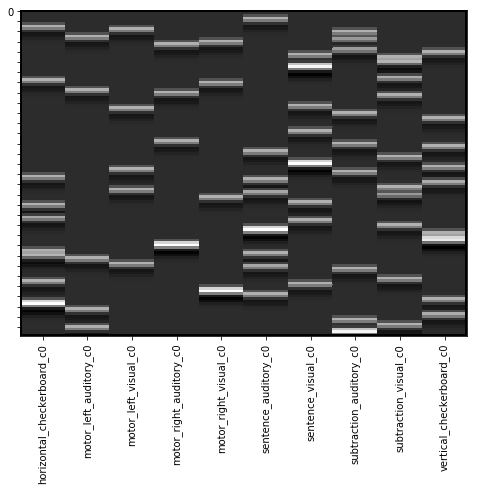
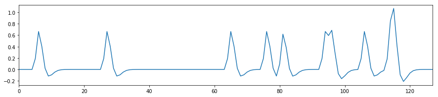
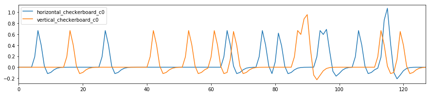
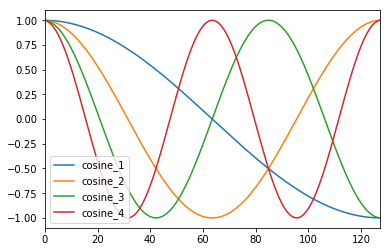
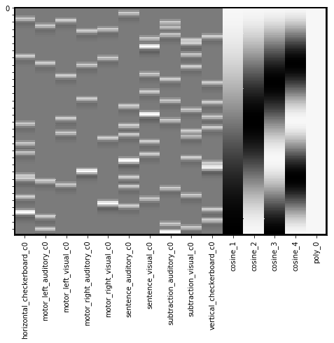
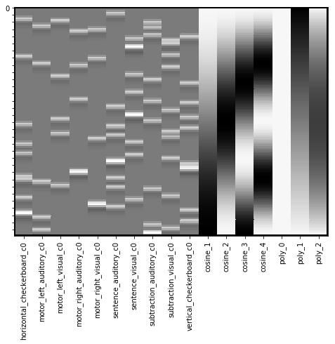
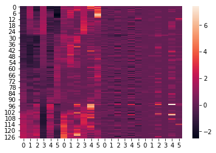
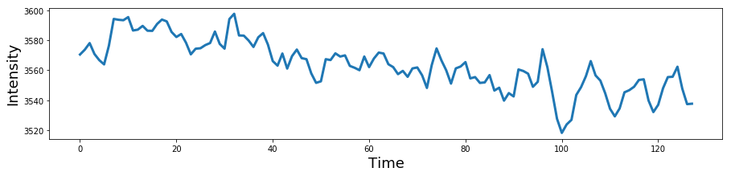
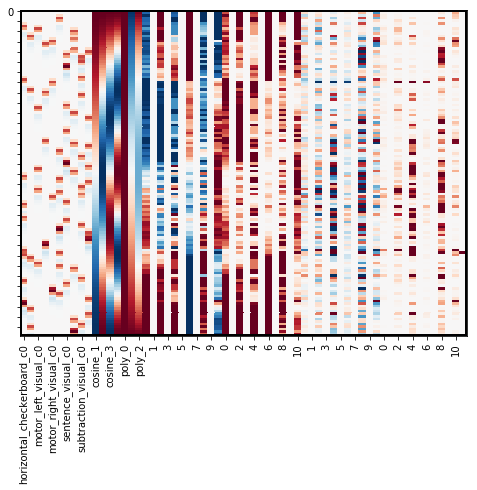

---
redirect_from:
  - "/features/notebooks/10-glm-single-subject-model"
interact_link: content/features/notebooks/10_GLM_Single_Subject_Model.ipynb
kernel_name: conda-env-py36-py
title: 'Modeling Single Subject Data'
prev_page:
  url: /features/notebooks/9_GLM
  title: 'Introduction to the General Linear Model'
next_page:
  url: /features/notebooks/11_Group_Analysis
  title: 'Modeling Group Data'
comment: "***PROGRAMMATICALLY GENERATED, DO NOT EDIT. SEE ORIGINAL FILES IN /content***"
---

# Single Subject First Level Models
*Written by Luke Chang*

The first step in fMRI data analysis is to build a model for each subject to predict the activation in a single voxel over the entire scanning session. To do this, we need to build a design matrix for our general linear model. We expect distinct brain regions to be involved in processing specific aspects of our task. This means that we will construct separate regressors that model different brain processes. Here we will load a pre-made design matrix with the onsets of each trial from the Pinel Localizer task. 

The Pinel Localizer task was designed to probe several different types of basic cognitive processes, such as visual perception, finger tapping, language, and math. Several of the tasks are cued by reading text on the screen (i.e., visual modality) and also by hearing auditory instructions (i.e., auditory modality). The trials are randomized across conditions and have been optimized to maximize efficiency for a rapid event related design. There are 100 trials in total over a 5-minute scanning session. Read the [paper](https://bmcneurosci.biomedcentral.com/articles/10.1186/1471-2202-8-91) for more specific details about the task. You can also view the Data on the author's [cubicweb](http://brainomics.cea.fr/localizer/dataset?rql=Any%20X%2C%20XT%2C%20XL%2C%20XI%2C%20XF%2C%20XD%20WHERE%20X%20is%20Scan%2C%20X%20type%20XT%2C%20X%20label%20XL%2C%20X%20identifier%20XI%2C%20X%20format%20XF%2C%20X%20description%20XD) interface.

I encourage you to watch some short introductory videos on the GLM by Tor Wager and Martin Lindquist.
 - [GLM Applied to fMRI](https://www.youtube.com/watch?v=OyLKMb9FNhg&list=PLfXA4opIOVrGHncHRxI3Qa5GeCSudwmxM&index=19)
 - [Conditions & Contrasts](https://www.youtube.com/watch?v=7MibM1ATai4&list=PLfXA4opIOVrGHncHRxI3Qa5GeCSudwmxM&index=20)
 - [Temporal Basis Sets](https://www.youtube.com/watch?v=YfeMIcDWwko&list=PLfXA4opIOVrGHncHRxI3Qa5GeCSudwmxM&index=21)
 - [Nuisance Variables](https://www.youtube.com/watch?v=DEtwsFdFwYc&list=PLfXA4opIOVrGHncHRxI3Qa5GeCSudwmxM&index=22)
 - [Inference/Contrasts/T-Tests ](https://www.youtube.com/watch?v=NRunOo7EKD8&list=PLfXA4opIOVrGHncHRxI3Qa5GeCSudwmxM&index=25)
 
 Let's first load all of the python modules we will need to complete this tutorial.


{:.input_area}
```python
%matplotlib inline

import os
import glob
import numpy as np
import pandas as pd
import matplotlib.pyplot as plt
import seaborn as sns
from nltools.stats import regress, zscore
from nltools.data import Brain_Data, Design_Matrix
from nltools.stats import find_spikes 
from nilearn.plotting import view_img, glass_brain, plot_stat_map

netid = 'f00275v'
output_dir = '/dartfs/rc/lab/P/Psych60/students_output/%s' % netid
data_dir = '/dartfs/rc/lab/P/Psych60/data/brainomics_data/'

output_dir = '/Volumes/Psych60/students_output/%s' % netid
data_dir = '/Volumes/Psych60/data/brainomics_data/'
```


To build the design matrix, we will be using the Design_Matrix class from the nltools toolbox.  First, we use pandas to load the text file that contains the onset and duration for each condition of the task. Rows reflect measurements in time sampled at 1/tr cycles per second. Columns reflect distinct conditions. Conditions are either on or off. We then cast this Pandas DataFrame as a Design_Matrix object. Be sure to specify the sampling frequency, which is $\frac{1}{tr}$. 


{:.input_area}
```python
tr = 2.4
df = pd.read_csv(os.path.join(data_dir, 'Design_Matrix.csv'))
dm = Design_Matrix(df, sampling_freq=1/tr)
```


The Design_Matrix class is built on top of Pandas DataFrames and retains most of that functionality. There are additional methods to help with building design matrices. Be sure to check out this [tutorial](https://neurolearn.readthedocs.io/en/latest/auto_examples/01_DataOperations/plot_design_matrix.html#sphx-glr-auto-examples-01-dataoperations-plot-design-matrix-py) for more information about how to use this tool. 

We can check out details about the data using the `.info()` method.


{:.input_area}
```python
dm.info()
```


{:.output .output_stream}
```
<class 'nltools.data.design_matrix.Design_Matrix'>
RangeIndex: 128 entries, 0 to 127
Data columns (total 10 columns):
horizontal_checkerboard    128 non-null float64
motor_left_auditory        128 non-null float64
motor_left_visual          128 non-null float64
motor_right_auditory       128 non-null float64
motor_right_visual         128 non-null float64
sentence_auditory          128 non-null float64
sentence_visual            128 non-null float64
subtraction_auditory       128 non-null float64
subtraction_visual         128 non-null float64
vertical_checkerboard      128 non-null float64
dtypes: float64(10)
memory usage: 10.1 KB

```

We can also view the raw design matrix as a dataframe just like pd.Dataframe.  We use the `.head()` method to just post the first few rows.


{:.input_area}
```python
dm.head()
```


<div markdown="0" class="output output_html">
<div>
<style scoped>
    .dataframe tbody tr th:only-of-type {
        vertical-align: middle;
    }

    .dataframe tbody tr th {
        vertical-align: top;
    }

    .dataframe thead th {
        text-align: right;
    }
</style>
<table border="1" class="dataframe">
  <thead>
    <tr style="text-align: right;">
      <th></th>
      <th>horizontal_checkerboard</th>
      <th>motor_left_auditory</th>
      <th>motor_left_visual</th>
      <th>motor_right_auditory</th>
      <th>motor_right_visual</th>
      <th>sentence_auditory</th>
      <th>sentence_visual</th>
      <th>subtraction_auditory</th>
      <th>subtraction_visual</th>
      <th>vertical_checkerboard</th>
    </tr>
  </thead>
  <tbody>
    <tr>
      <th>0</th>
      <td>0.0</td>
      <td>0.0</td>
      <td>0.0</td>
      <td>0.0</td>
      <td>0.0</td>
      <td>1.0</td>
      <td>0.0</td>
      <td>0.0</td>
      <td>0.0</td>
      <td>0.0</td>
    </tr>
    <tr>
      <th>1</th>
      <td>0.0</td>
      <td>0.0</td>
      <td>0.0</td>
      <td>0.0</td>
      <td>0.0</td>
      <td>0.0</td>
      <td>0.0</td>
      <td>0.0</td>
      <td>0.0</td>
      <td>0.0</td>
    </tr>
    <tr>
      <th>2</th>
      <td>0.0</td>
      <td>0.0</td>
      <td>0.0</td>
      <td>0.0</td>
      <td>0.0</td>
      <td>0.0</td>
      <td>0.0</td>
      <td>0.0</td>
      <td>0.0</td>
      <td>0.0</td>
    </tr>
    <tr>
      <th>3</th>
      <td>1.0</td>
      <td>0.0</td>
      <td>0.0</td>
      <td>0.0</td>
      <td>0.0</td>
      <td>0.0</td>
      <td>0.0</td>
      <td>0.0</td>
      <td>0.0</td>
      <td>0.0</td>
    </tr>
    <tr>
      <th>4</th>
      <td>0.0</td>
      <td>0.0</td>
      <td>1.0</td>
      <td>0.0</td>
      <td>0.0</td>
      <td>0.0</td>
      <td>0.0</td>
      <td>0.0</td>
      <td>0.0</td>
      <td>0.0</td>
    </tr>
  </tbody>
</table>
</div>
</div>


We can plot each regressor's time course using the `.plot()` method.


{:.input_area}
```python
f,a = plt.subplots(figsize=(20,3))
dm.plot(ax=a)
```


{:.output .output_data_text}
```
<matplotlib.axes._subplots.AxesSubplot at 0x1c1ceeaac8>
```


{:.output .output_png}


This plot can be useful sometimes, but here there are too many regressors, which makes it difficult to see what is going on.

Often,  `.heatmap()` method provides a more useful visual representation of the design matrix.


{:.input_area}
```python
dm.heatmap()
```


{:.output .output_png}


## HRF Convolution
Recall what we learned about convolution in our signal processing tutorial. We can now convolve all of the onset regressors with an HRF function using the `.convolve()` method. By default it will convolve all regressors with the standard double gamma HRF function, though you can specify custom ones and also specific regressors to convolve. Check out the docstrings for more information by adding a `?` after the function name.


{:.input_area}
```python
dm_conv = dm.convolve()
dm_conv.heatmap()
```


{:.output .output_png}



You can see that each of the regressors is now  bit blurrier and now has the shape of an HRF function. We can plot a single regoressor to see this more clearly using the `.plot()` method.


{:.input_area}
```python
f,a = plt.subplots(figsize=(15,3))
dm_conv['horizontal_checkerboard_c0'].plot(ax=a)
```


{:.output .output_data_text}
```
<matplotlib.axes._subplots.AxesSubplot at 0x112ca8208>
```


{:.output .output_png}



Maybe we want to plot both of the checkerboard regressors.


{:.input_area}
```python
f,a = plt.subplots(figsize=(15,3))
dm_conv[['horizontal_checkerboard_c0','vertical_checkerboard_c0']].plot(ax=a)
```


{:.output .output_data_text}
```
<matplotlib.axes._subplots.AxesSubplot at 0x1c1e54e278>
```


{:.output .output_png}



## Multicollinearity
In statistics, collinearity or multicollinearity is when one regressor can be strongly linearly predicted from the others. While this does not actually impact the model's ability to predict data as a whole, it will impact our ability to accurately attribute variance to a single regressor. Recall that in multiple regression, we are estimating the independent variance from each regressor from `X` on `Y`. If there is substantial overlap between the regressors, then the estimator can not attribute the correct amount of variance each regressor accounts for `Y` and the coefficients can become unstable. A more intuitive depiction of this problem can be seen in the venn diagram. The dark orange area in the center at the confluence of all 3 circles reflects the shared variance between `X1` and `X2` on `Y`. If this area becomes bigger, the unique variances become smaller and individually reflect less of the total variance on `Y`.


One way to evaluate multicollinearity is to examine the pairwise correlations between each regressor. We plot the correlation matrix as a heatmap.


{:.input_area}
```python
sns.heatmap(dm_conv.corr(), vmin=-1, vmax=1)
```


{:.output .output_data_text}
```
<matplotlib.axes._subplots.AxesSubplot at 0x1c1c178668>
```


{:.output .output_png}


### Variance Inflation Factor
Pairwise correlations will let you know if any regressor is correlated with another regressor. However, we are even more concerned about being able to explain any regressor as a linear combination of the other regressors. For example, *can one regressor be explained by three or more of the remaining regressors?* The variance inflation factor (VIF) is a metric that can help us detect multicollinearity. Specifically, it is simply the ratio of variance in a model with multiple terms, divided by the variance of a model with only a single term. This ratio reduces to the following formula:

$VIF_j=\frac{1}{1-R_i^2}$

Where $R_j^2$ is the $R^2$ value obtained by regressing the $jth$ predictor on the remaining predictors. This means that each regressor $j$ will have it's own variance inflation factor.

How should we interpret the VIF values?  

A VIF of 1 indicates that there is no correlation among the $jth$ predictor and the remaining variables. Values greater than 4 should be investigated further, while VIFs exceeding 10 indicate significant multicollinearity and will likely require intervention.

Here we will use the `.vif()` method to calculate the variance inflation factor for our design matrix.

See this [overview](https://newonlinecourses.science.psu.edu/stat501/node/347/) for more details on VIFs.


{:.input_area}
```python
plt.plot(dm_conv.columns, dm_conv.vif(), linewidth=3)
plt.xticks(rotation=90)
plt.ylabel('Variance Inflation Factor')
```


{:.output .output_data_text}
```
Text(0, 0.5, 'Variance Inflation Factor')
```


{:.output .output_png}


### Orthogonalization
There are many ways to deal with collinearity. In practice, don't worry about collinearity between your covariates. The more pernicious issues are collinearity in your experimental design. 

It is commonly thought that using a procedure called orthogonalization should be used to address issues of multicollinearity. In linear algebra, orthogonalization is the process of prioritizing shared variance between regressors to a single regressor. Recall that the standard GLM already accounts for shared variance by removing it from individual regressors. Orthogonalization allows a user to assign that variance to a specific regressor. However, the process of performing this procedure can introduce artifact into the model and often changes the interpretation of the beta weights in unanticipated ways.


In general, we do not recommend using orthogonalization in most use cases, with the expection of centering regressor variables. We encourage the interested reader to review this very useful [overview](https://journals.plos.org/plosone/article?id=10.1371/journal.pone.0126255) of collinearity and orthogonalization by Jeanette Mumford and colleagues.

## Filtering
Recall from our signal processing tutorial, that there are often other types of artifacts in our signal that might take the form of slow or fast oscillations. It is common to apply a low pass filter to the data to remove low frequency artifacts. Often this can also be addressed by simply using a few polynomials to model these types of trends. If we were to directly filter the brain data using something like a butterworth filter as we did in our signal processing tutorial, we would also need to apply it to our design matrix to make sure that we don't have any low frequency drift in experimental design. One easy way to simultaneously perform both of these procedures is to simply build a filter into the design matrix. We will be using a discrete cosine transform (DCT), which is a basis set of cosine regressors of varying frequencies up to a filter cutoff of a specified number of seconds. Many software use 100s or 128s as a default cutoff, but we encourage caution that the filter cutoff isn't too short for your specific experimental design. Longer trials will require longer filter cutoffs. See this [paper](https://www.sciencedirect.com/science/article/pii/S1053811900906098) for a more technical treatment of using the DCT as a high pass filter in fMRI data analysis. In addition, here is a more detailed discussion about [filtering](http://mindhive.mit.edu/node/116).


{:.input_area}
```python
dm_conv_filt = dm_conv.add_dct_basis(duration=128)
```


{:.input_area}
```python
dm_conv_filt.iloc[:,10:].plot()
```


{:.output .output_data_text}
```
<matplotlib.axes._subplots.AxesSubplot at 0x1c4fcda4e0>
```


{:.output .output_png}



{:.input_area}
```python
dm_conv_filt = dm_conv.add_dct_basis(duration=128)
dm_conv_filt.heatmap()
```


{:.output .output_png}



## Intercepts
We almost always want to include an intercept in our model. This will usually reflect the baseline, or the average voxel response during the times that are not being modeled as a regressor. It is important to note that you must have some sparsity to your model, meaning that you can't model every point in time, as this will make your model rank deficient and unestimable.

If you are concatenating runs and modeling them all together, it is recommended to include a separate intercept for each run, but not for the entire model. This means that the average response within a voxel might differ across runs. You can add an intercept by simply creating a new column of ones (e.g., `dm['Intercept] = 1`). Here we provide an example using the `.add_poly()` method, which adds an intercept by default.


{:.input_area}
```python
dm_conv_filt_poly = dm_conv_filt.add_poly()
dm_conv_filt_poly.heatmap()
```


{:.output .output_png}


## Linear Trends
We also often want to remove any slow drifts in our data.  This might include a linear trend and a quadratic trend. We can also do this with the `.add_poly()` method and adding all trends up to an order of 2 (e.g., quadratic).

Notice that these do not appear to be very different from the high pass filter basis set. It's actually okay if there is collinearity in our covariate regressors. Collinearity is only a problem when it correlates with the task regressors as it means that we will not be able to uniquely model the variance. The DCT can occasionally run into edge artifacts, which can be addressed by the linear trend.


{:.input_area}
```python
dm_conv_filt_poly = dm_conv_filt.add_poly(order=2, include_lower=True)
dm_conv_filt_poly.heatmap()
```


{:.output .output_png}



## Noise Covariates
Another important thing to consider is removing variance associated with head motion. Remember the preprocessed data has already realigned each TR in space, but head motion itself can nonlinearly distort the magnetic field. There are several common strategies for trying to remove artifacts associated with head motion. One is using a data driven denoising algorithm like ICA and combining it with a classifer such as FSL's [FIX](https://fsl.fmrib.ox.ac.uk/fsl/fslwiki/FIX) module. Another approach is to include the amount of correction that needed to be applied to align each TR. For example, if someone moved a lot in a single TR, there will be a strong change in their realignment parameters. It is common to include the 6 parameters as covariates in your regression model. However, as we already noted, often motion can have a nonlinear relationship with signal intensity, so it is often good to include other transformations of these signals to capture nonlinear signal changes resulting from head motion. We typically center the six realigment parameters (or zscore) and then additionally add a quadratic version, a derivative, and the square of the derivatives, which becomes 24 additional regressors. 

In addition, it is common to model out big changes using a regressor with a single value indicating the timepoint of the movement. This will be zeros along time, with a single value of one at the time point of interest. This effectively removes any variance associated with this single time point. It is important to model each "spike" as a separate regressor as there might be distinct spatial patterns associated with different types of head motions. We strongly recommond against using a single continuous frame displacement metric as is often recommended by the fMRIprep team. This assumes (1) that there is a *linear* relationship between displacement and voxel activity, and (2) that there is a *single* spatial generator or pattern associated with frame displacement. As we saw in the ICA noise lab, there might be many different types of head motion artifacts. This procedure of including spikes as nuisance regressors is mathematically equivalent to censoring your data and removing the bad TRs. We think it is important to do this in the context of the GLM as it will also reduce the impact if it happens to covary with your task.

First, let's load preprocessed data from one participant.


{:.input_area}
```python
sub = 'S01'
file_name = os.path.join(data_dir, sub ,'preprocessed_fMRI_bold.nii.gz')
data = Brain_Data(file_name)
```


Now let's inspect the realignment parameters for this participant. These pertain to how much each volume had to be moved in the (X,Y,Z) planes and rotations around each axis. We are standardizing the data so that rotations and translations are on the same scale.


{:.input_area}
```python
mc = pd.read_csv(os.path.join(data_dir, sub ,'realignment_parameters.txt'), sep='\s', header=None)
plt.figure(figsize=(15,5))
plt.plot(zscore(mc))
```


{:.output .output_data_text}
```
[<matplotlib.lines.Line2D at 0x1c21215da0>,
 <matplotlib.lines.Line2D at 0x1c212153c8>,
 <matplotlib.lines.Line2D at 0x1c212157b8>,
 <matplotlib.lines.Line2D at 0x1c212156d8>,
 <matplotlib.lines.Line2D at 0x1c21215710>,
 <matplotlib.lines.Line2D at 0x1c21993208>,
 <matplotlib.lines.Line2D at 0x1c219935c0>,
 <matplotlib.lines.Line2D at 0x1c21993ac8>,
 <matplotlib.lines.Line2D at 0x1c21993d68>,
 <matplotlib.lines.Line2D at 0x1c219936a0>,
 <matplotlib.lines.Line2D at 0x1c21917208>]
```


{:.output .output_png}



Now, let's build the 24 covariates related to head motion. We include the 6 realignment parameters that have been standardized. In addition, we add their quadratic, their derivative, and the square of their derivative.

We can create a quick visualization to see what the overall pattern is across the different regressors.


{:.input_area}
```python
def make_motion_covariates(mc):
    z_mc = zscore(mc)
    all_mc = pd.concat([z_mc, z_mc**2, z_mc.diff(), z_mc.diff()**2], axis=1)
    all_mc.fillna(value=0, inplace=True)
    return Design_Matrix(all_mc, sampling_freq=1/tr)

mc = pd.read_csv(os.path.join(data_dir, sub ,'realignment_parameters.txt'), sep='\s', header=None)

mc_cov = make_motion_covariates(mc)

sns.heatmap(mc_cov)
```


{:.output .output_data_text}
```
<matplotlib.axes._subplots.AxesSubplot at 0x1c210d82e8>
```


{:.output .output_png}



Now let's try to find some spikes in the data. This is performed by finding TRs that exceed a global mean threshold and also that exceed an overall average intensity change by a threshold.  We are using an arbitrary cutoff of 3 standard deviations as a threshold.

First, let's plot the average signal intensity across all voxels over time.


{:.input_area}
```python
plt.figure(figsize=(15,3))
plt.plot(np.mean(data.data, axis=1), linewidth=3)
plt.xlabel('Time', fontsize=18)
plt.ylabel('Intensity', fontsize=18)
```


{:.output .output_data_text}
```
Text(0, 0.5, 'Intensity')
```


{:.output .output_png}


Notice there is a clear slow drift in the signal that we will need to remove with our high pass filter.

Now, let's see if there are any spikes in the data that exceed our threshold. What happens if we use a different threshold?


{:.input_area}
```python
spikes = data.find_spikes(global_spike_cutoff=3, diff_spike_cutoff=3)

f, a = plt.subplots(figsize=(15,3))
spikes = Design_Matrix(spikes.iloc[:,1:], sampling_freq=1/tr)
spikes.plot(ax = a, linewidth=2)
```


{:.output .output_data_text}
```
<matplotlib.axes._subplots.AxesSubplot at 0x1c211e4470>
```


{:.output .output_png}


For this subject, our spike identification procedure only found a single spike. Let's add all of these covariate to our design matrix.

In this example, we will append each of these additional matrices to our main design matrix. 

**Note**: `.append()` requires that all matrices are a design_matrix with the same sampling frequency.


{:.input_area}
```python
dm_conv_filt_poly_cov = dm_conv_filt_poly.append(mc_cov, axis=1).append(spikes, axis=1)
dm_conv_filt_poly_cov.heatmap(cmap='RdBu_r', vmin=-1,vmax=1)
```


{:.output .output_png}



## Estimate model for all voxels
Now we are ready to estimate the regression model for all voxels.

We will assign the design_matrix object to the `.X` attribute of our `Brain_Data` instance.

Then we simply need to run the `.regress()` method.


{:.input_area}
```python
data.X = dm_conv_filt_poly_cov
stats = data.regress()

print(stats.keys())
```


{:.output .output_stream}
```
dict_keys(['beta', 't', 'p', 'sigma', 'residual'])

```

Ok, it's done! Let's take a look at the results.

The stats variable is a dictionary with the main results from the regression: a brain image with all of the betas for each voxel, a correspondign image of t-values, p-values, standard error of the estimate, and residuals.

Remember we have run the same regression model separately on each voxel of the brain.

Let's take a look at one of the regressors. The names of each of them are in the column names of the design matrix, which is in the `data.X` field.  We can print them to see the names. Let's plot the first one, which is a horizontal checkerboard.


{:.input_area}
```python
print(data.X.columns)
```


{:.output .output_stream}
```
Index(['horizontal_checkerboard_c0', 'motor_left_auditory_c0',
       'motor_left_visual_c0', 'motor_right_auditory_c0',
       'motor_right_visual_c0', 'sentence_auditory_c0', 'sentence_visual_c0',
       'subtraction_auditory_c0', 'subtraction_visual_c0',
       'vertical_checkerboard_c0', 'cosine_1', 'cosine_2', 'cosine_3',
       'cosine_4', 'poly_0', 'poly_1', 'poly_2', '0', '1', '2', '3', '4', '5',
       '6', '7', '8', '9', '10', '0', '1', '2', '3', '4', '5', '6', '7', '8',
       '9', '10', '0', '1', '2', '3', '4', '5', '6', '7', '8', '9', '10', '0',
       '1', '2', '3', '4', '5', '6', '7', '8', '9', '10', 'diff_spike1'],
      dtype='object')

```

Brain_Data instances have their own plotting methods. We will be using `.iplot()` here, which can allow us to interactively look at all of the values.

If you would like to see the top values, we can quickly apply a threshold. Try using `95`% threshold, and be sure to click the `percentile_threshold` option.


{:.input_area}
```python
stats['beta'][0].iplot()
```


{:.output .output_data_text}
```
interactive(children=(FloatText(value=0.0, description='Threshold'), HTML(value='Image is 3D', description='Vo…
```


## Smoothing

To increase the signal to noise ratio and clean up the data, it is common to apply spatial smoothing to the image.

Here we will convolve the image with a 3-D gaussian kernel, with a 6mm full width half maximum (FWHM) using the `.smooth()` method.


{:.input_area}
```python
smoothed = stats['beta'].smooth(fwhm=6)
```


Let's take a look and see how this changes the image.


{:.input_area}
```python
smoothed[0].iplot()
```


{:.output .output_data_text}
```
interactive(children=(FloatText(value=0.0, description='Threshold'), HTML(value='Image is 3D', description='Vo…
```


## Save Image
We will frequently want to save different brain images we are working with to a nifti file. This is useful for saving intermediate work, or sharing our results with others. This is easy with the `.write()` method. Be sure to specify a path and file name for the file.

**Note**: You can only write to folders where you have permission. Try changing the path to your own directory.


{:.input_area}
```python
smoothed.write(os.path.join(data_dir, sub, 'denoised_smoothed_preprocessed_fMRI_bold.nii.gz'))
```


# Contrasts

Now that we have estimated our model, we will likely want to create contrasts to examine brain activation to different conditions.

This procedure is identical to those introduced in our GLM tutorial.

First, let's try making a simple contrast where we average only the regressors pertaining to motor. This is essentially summing all of the motor regressors. To take the mean we need to divide by the number of regressors. 


{:.input_area}
```python
print(data.X.columns)

c1 = np.zeros(len(stats['beta']))
c1[[1,2,3,4]] = 1/4
print(c1)

motor = smoothed * c1

motor.iplot()
```


{:.output .output_stream}
```
Index(['horizontal_checkerboard_c0', 'motor_left_auditory_c0',
       'motor_left_visual_c0', 'motor_right_auditory_c0',
       'motor_right_visual_c0', 'sentence_auditory_c0', 'sentence_visual_c0',
       'subtraction_auditory_c0', 'subtraction_visual_c0',
       'vertical_checkerboard_c0', 'cosine_1', 'cosine_2', 'cosine_3',
       'cosine_4', 'poly_0', 'poly_1', 'poly_2', '0', '1', '2', '3', '4', '5',
       '6', '7', '8', '9', '10', '0', '1', '2', '3', '4', '5', '6', '7', '8',
       '9', '10', '0', '1', '2', '3', '4', '5', '6', '7', '8', '9', '10', '0',
       '1', '2', '3', '4', '5', '6', '7', '8', '9', '10', 'diff_spike1'],
      dtype='object')
[0.   0.25 0.25 0.25 0.25 0.   0.   0.   0.   0.   0.   0.   0.   0.
 0.   0.   0.   0.   0.   0.   0.   0.   0.   0.   0.   0.   0.   0.
 0.   0.   0.   0.   0.   0.   0.   0.   0.   0.   0.   0.   0.   0.
 0.   0.   0.   0.   0.   0.   0.   0.   0.   0.   0.   0.   0.   0.
 0.   0.   0.   0.   0.   0.  ]

```


{:.output .output_data_text}
```
interactive(children=(FloatText(value=0.0, description='Threshold'), HTML(value='Image is 3D', description='Vo…
```


Ok, now we can clearly see regions specifically involved in motor processing.

Now let's see which regions are more active when making motor movements with our left hand compare to our right hand.


{:.input_area}
```python
c_lvr = np.zeros(len(stats['beta']))
c_lvr[[1,2,3,4]] = [.5, .5, -.5, -.5]

motor_lvr = smoothed * c_lvr

motor_lvr.iplot()
```


{:.output .output_data_text}
```
interactive(children=(FloatText(value=0.0, description='Threshold'), HTML(value='Image is 3D', description='Vo…
```


What do you see?

# Exercises

For homework, let's get a better handle on how to play with our data and test different hypotheses.

First, make a folder called `10_GLM_Single_Subject_Model` in your output directory so that I can see your results.

## 1. Which regions are more involved with visual compared to auditory sensory processing?
 - Create a contrast to test this hypothesis
 - plot the results
 - write the file to your output folder.

## 2. Which regions are more involved in processing numbers compared to words?
 - Create a contrast to test this hypothesis
 - plot the results
 - write the file to your output folder.

## 3. Which regions are more involved with motor compared to cognitive processes (e.g., language and math)?
 - Create a contrast to test this hypothesis
 - plot the results
 - write the file to your output folder.

## 4. How are your results impacted by different smoothing kernels?
 - Pick two different sized smoothing kernels and create two new brain images with each smoothing kernel
 - Pick any contrast of interest to you and evaluate the impact of smoothing on the contrast.
 - plot the results
 - write the file to your output folder.
