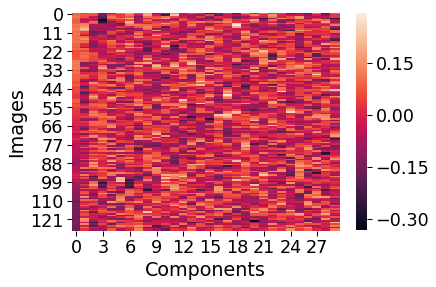
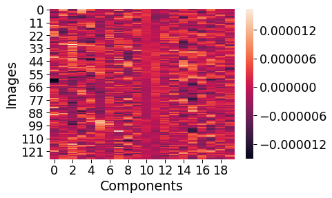
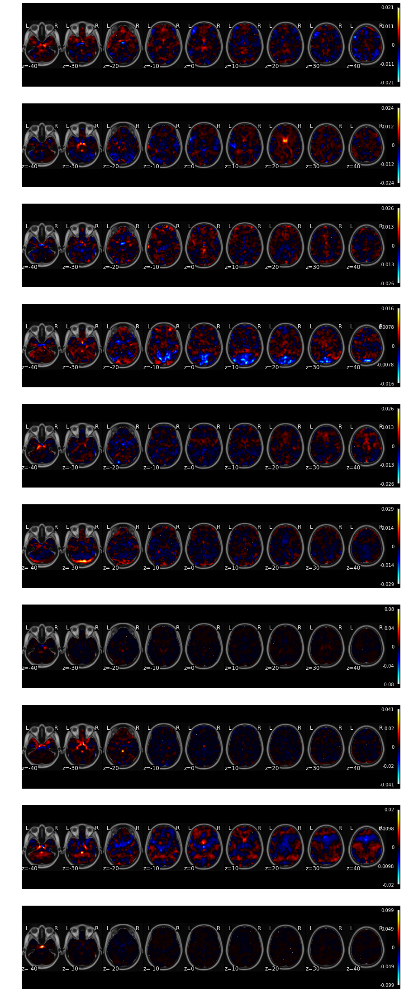

---
redirect_from:
  - "/features/notebooks/4-ica"
interact_link: content/features/notebooks/4_ICA.ipynb
kernel_name: python3
title: 'Separating Signal from Noise with ICA'
prev_page:
  url: /features/notebooks/3_Introduction_to_NeuroimagingData_in_Python
  title: 'Introduction to Neuroimaging Data'
next_page:
  url: /features/notebooks/5_Signal_Processing
  title: 'Signal Processing Basics'
comment: "***PROGRAMMATICALLY GENERATED, DO NOT EDIT. SEE ORIGINAL FILES IN /content***"
---

# Identifying Signal and Noise Using ICA
*Written by Luke Chang*

In this lab we will explore using ICA to examine different signals in our data that may correspond to actual signal or noise.  This notebook is currently still a work in progress. 


{:.input_area}
```python
%matplotlib inline

import os
import glob
import nibabel as nib
import numpy as np
import pandas as pd
import matplotlib.pyplot as plt
import seaborn as sns
from nltools.data import Brain_Data, Adjacency
from nltools.simulator import Simulator
from nltools.mask import create_sphere
from nltools.stats import align
from nltools.datasets import fetch_localizer

base_dir = '/Users/lukechang/Dropbox/Dartmouth/Teaching/Psych60_HumanBrainImaging/2019S/Homework/5_Preprocessing'

```


{:.input_area}
```python
sub_ids = ['S%02d' % x for x in np.arange(1,2)]
f = fetch_localizer(subject_ids=sub_ids, get_anats=False, data_type='preprocessed')

```


{:.output .output_stream}
```
Downloading data from http://brainomics.cea.fr/localizer/dataset/cubicwebexport.csv ...
Downloading data from http://brainomics.cea.fr/localizer/dataset/cubicwebexport2.csv ...

```


{:.input_area}
```python
print(f.keys())
print(f['functional'])


assert isinstance(f['functional'], list)
assert f['structural'] is None
assert isinstance(f['ext_vars'], pd.DataFrame)
```


{:.output .output_stream}
```
dict_keys(['functional', 'structural', 'ext_vars', 'description'])
[['/Users/lukechang/nilearn_data/brainomics_localizer/brainomics_data/S01/preprocessed_fMRI_bold.nii.gz']]

```


{:.input_area}
```python
epi = nib.load('/Users/lukechang/nilearn_data/brainomics_localizer/brainomics_data/S01/preprocessed_fMRI_bold.nii.gz')
epi.data = np.squeeze(epi.get_data())
data = Brain_Data(epi)
```


To perform an ICA on your data it is useful to first run a PCA to identify the components that explain the most variance.  Then we run an ICA on the identified principal components. One key step is to first remove the mean from the features of your data.


{:.input_area}
```python
n_pca_components = 30
n_components = 30
data = data.standardize()
pca_output = data.decompose(algorithm='pca', axis='images', n_components=n_pca_components)
pca_ica_output = pca_output['components'].decompose(algorithm='ica', axis='images', n_components=n_components)

# with sns.plotting_context(context='paper', font_scale=2):
#     sns.heatmap(pca_output['weights'])
#     plt.ylabel('Images')
#     plt.xlabel('Components')
    
# f = pca_output['components'].plot(limit=n_components)
```


{:.input_area}
```python
sns.heatmap(pca_output['weights'])
```


{:.output .output_data_text}
```
<matplotlib.axes._subplots.AxesSubplot at 0x1c45fb64e0>
```


{:.output .output_png}


{:.input_area}
```python
sns.heatmap(pca_ica_output['weights'])
```


{:.output .output_data_text}
```
<matplotlib.axes._subplots.AxesSubplot at 0x1c2c4168d0>
```


{:.output .output_png}


{:.input_area}
```python
np.dot(pcapca_ica_output['weights'])
```


{:.output .output_data_text}
```
array([-5.84524444e-07,  2.49644866e-07,  1.02972636e-06, -6.31667826e-06,
       -5.53854517e-07,  7.87689412e-06, -6.32291457e-06,  4.51320826e-06,
        7.25636722e-06,  5.75422287e-06,  1.08532153e-06,  1.18187483e-06,
       -7.50478777e-06, -3.80959640e-06, -1.38886157e-05, -1.16747673e-05,
       -2.42887923e-05, -6.29824682e-06, -2.66351728e-05, -6.81105890e-06,
       -4.26965810e-06, -5.57845085e-06, -1.28074288e-05,  9.69900755e-07,
        1.01387281e-05, -6.14667315e-06, -3.29411654e-06,  1.97241357e-05,
       -1.02592616e-06, -1.61356631e-05])
```


{:.input_area}
```python
pca_ica_output = pca_output['components'].decompose(algorithm='ica', axis='images')

with sns.plotting_context(context='paper', font_scale=2):
    sns.heatmap(pca_ica_output['weights'])
    plt.ylabel('Images')
    plt.xlabel('Components')

f = pca_ica_output['components'].plot(limit=n_components)
```


{:.output .output_stream}
```
threshold is ignored for simple axial plots

```


{:.output .output_png}


{:.output .output_png}


{:.input_area}
```python
with sns.plotting_context(context='paper', font_scale=2):
    sns.heatmap(pca_output['weights'])
    plt.ylabel('Images')
    plt.xlabel('Components')
```


{:.output .output_png}



{:.input_area}
```python
plt.plot(pca_output['decomposition_object'].explained_variance_ratio_)
```


{:.output .output_data_text}
```
[<matplotlib.lines.Line2D at 0x1c2ae8e7f0>]
```


{:.output .output_png}


{:.input_area}
```python
plt.plot(pca_output['decomposition_object'].explained_variance_ratio_)
```


{:.output .output_data_text}
```
[<matplotlib.lines.Line2D at 0x1c2f64a3c8>]
```


{:.output .output_png}


{:.input_area}
```python
n_components=30

ica_output = data.decompose(algorithm='ica', axis='images', n_components=n_components)

with sns.plotting_context(context='paper', font_scale=2):
    sns.heatmap(ica_output['weights'])
    plt.ylabel('Images')
    plt.xlabel('Components')

f = ica_output['components'].plot(limit=10)
```


{:.output .output_stream}
```
threshold is ignored for simple axial plots

```


{:.output .output_png}



{:.output .output_png}



{:.input_area}
```python
data.decompose?
```

